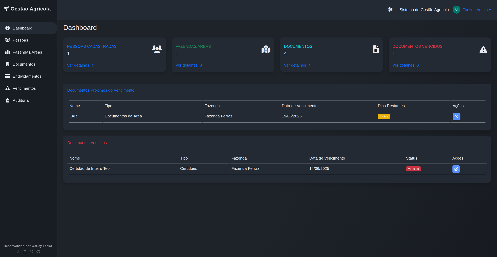

# 🌾 Sistema de Gestão Agrícola

  
[](https://gestao-agro-production.up.railway.app/)
[](LICENSE)
[](https://github.com/Frraz/Gestao-Agro-Beta/issues)
[](https://github.com/Frraz/Gestao-Agro-Beta/stargazers)

> **Gestão rural moderna, produtiva e automatizada. Foco em produtividade, controle financeiro e documentação.**

---

## 🔎 Veja online

- [➡️ Acesse a demonstração](https://gestao-agro-production.up.railway.app/)

---

## ✨ Por que usar?

- Notificações automáticas de vencimentos por e-mail
- Gestão de pessoas, fazendas, documentos e dívidas rurais
- Dashboard visual, responsivo, moderno e seguro
- Código aberto, fácil de customizar e implantar

---

## 📋 Principais Funcionalidades

- Cadastro completo de pessoas (CPF/CNPJ) e fazendas
- Upload, controle e vencimento de documentos
- Gestão de endividamentos, parcelas, garantias e valor da operação
- Notificações automáticas (até 7 alertas por e-mail)
- Histórico de envios e interface para testes
- Interface responsiva (desktop, tablet, mobile) com tema claro/escuro
- Otimizações de performance (cache, índices, lazy loading)
- Rotinas de manutenção e automação via script

---

## 🛠️ Tecnologias

- **Backend:** Flask, SQLAlchemy, MySQL/SQLite, Redis
- **Frontend:** Bootstrap 5, JavaScript (ES6+), CSS Custom Properties
- **Automação:** Python `schedule`, scripts de manutenção
- **Outros:** Docker, Docker Compose

---

## 🚀 Instalação Rápida

```bash
git clone https://github.com/Frraz/Gestao-Agro-Beta.git
cd Gestao-Agro-Beta
python -m venv venv
source venv/bin/activate  # Linux/Mac
venv\Scripts\activate     # Windows
pip install -r requirements.txt
cp .env.example .env      # Edite o arquivo com suas configurações
python src/main.py
```

---

## 🐳 Docker

```bash
docker-compose up --build
```

---

## 🔧 Manutenção e Tarefas Automáticas

Execute tarefas agendadas ou sob demanda:

```bash
python maintenance.py --task notificacoes    # Processar notificações de endividamento
python maintenance.py --task cache           # Limpar cache
python maintenance.py --task banco           # Otimizar banco de dados
python maintenance.py --task scheduler       # Iniciar rotinas automáticas
```

---

## 📋 Requisitos

- Python 3.8+
- MySQL 5.7+ ou SQLite (desenvolvimento)
- Redis (opcional para cache)
- Servidor SMTP para envio de e-mails

---

## 📁 Estrutura do Projeto

```
Gestao-Agro-Beta/
├── src/
│   ├── models/        # Modelos de dados
│   ├── routes/        # Rotas Flask
│   ├── forms/         # Formulários do sistema
│   ├── static/        # Arquivos estáticos (JS, CSS)
│   ├── templates/     # Templates Jinja2
│   ├── utils/         # Utilitários e serviços
│   └── main.py        # App principal
├── tests/             # Testes automatizados
├── docs/              # Documentação extra
├── logs/              # Logs da aplicação
├── uploads/           # Uploads de usuários
├── maintenance.py     # Script de manutenção
├── requirements.txt   # Dependências Python
└── README.md
```

---

## 🤝 Como Contribuir

1. Faça fork do projeto
2. Crie uma branch (`git checkout -b minha-melhoria`)
3. Commit e push
4. Abra um Pull Request

Veja as [issues abertas](https://github.com/Frraz/Gestao-Agro-Beta/issues).

---

## 📄 Licença

MIT. Veja o arquivo [LICENSE](LICENSE).

---

**Desenvolvido com ❤️ para a gestão agrícola moderna**